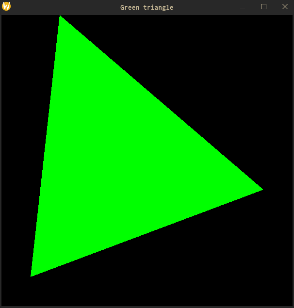

# grafika-hf-template

<div align="center">
    <picture>
        
    </picture>

An unofficial template project for BME VIK Computer Graphics homeworks
</div>

[](https://github.com/levy04/grafika-hf-template/actions/workflows/ci.yml)

## Dependencies

- Meson
- OpenGL dependencies (`glfw3`, `glew`, `glut`, etc...)

### Windows

Follow the Meson [guide](https://mesonbuild.com/Getting-meson.html) on how to download and get started with Meson, or simply download the MSI from their latest [releases](https://github.com/mesonbuild/meson/releases) page.

### Ubuntu

Run the following command to get the dependencies.

```bash
sudo apt-get update && sudo apt-get install -y mesa-utils libgl1-mesa-dev \
libglu1-mesa-dev libglm-dev freeglut3-dev libglew-dev libglfw3-dev \
python3 ninja-build meson
```

### MacOS

Run the following command to get the dependencies.

```bash
brew install mesa-glu glm glew glfw meson
```

## Usage

First, use this project as a template to get your own repository. Make sure to make it private. Alternatively, you can download this repository as a zip file, and copy paste it into your main project.

Make sure to write all your code in the `src.cpp` file, since JPorta is setup such that only one file is submittable. 

Set your project up with the `meson setup build` command, after which you can compile your code with `meson compile -C build`. This will generate an executable located at `./build/out`. After initial project setup, you can recompile any time with `meson compile -C build` or `ninja -C build`. If you want a clean build, issuing `meson setup --wipe build` will regenerate the build directory.

If you are using Visual Studio Code, there is an included `launch.json` and `tasks.json` to automate the compiling process, usually pressing `F5` will work on most setups. You will still need to initially run `meson setup build`.

To get more familiar with Meson, you can read the [manual](https://mesonbuild.com/Manual.html), or look at some [samples](https://mesonbuild.com/Meson-sample.html).

## Notes

### Outdated framework

As the semesters go on, new versions of `framework.cpp` and `framework.h` may be released, or the framework may change entirely, and require seperate dependencies. If you notice any discrepancies, please open an issue.

### MSVC quirks

Since the lecturer (most likely) uses MSVC to compile the submitted homeworks, the `framework.h` file has a hard-coded check for the `_HAS_CXX17` flag. As far as I know, this flag is only defined by MSVC, so gcc and clang users couldn't build their projects without either modifying `framework.h` or manually defining that flag.

This project also chose to manually define the `_HAS_CXX17` flag, so that the `framework.h` file remains unmodified, and as close as possible to the internal framework used to compile the homeworks.
